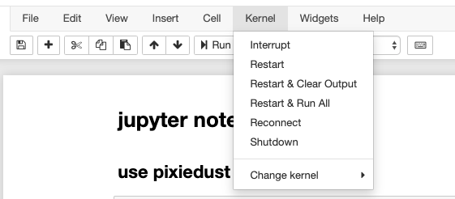
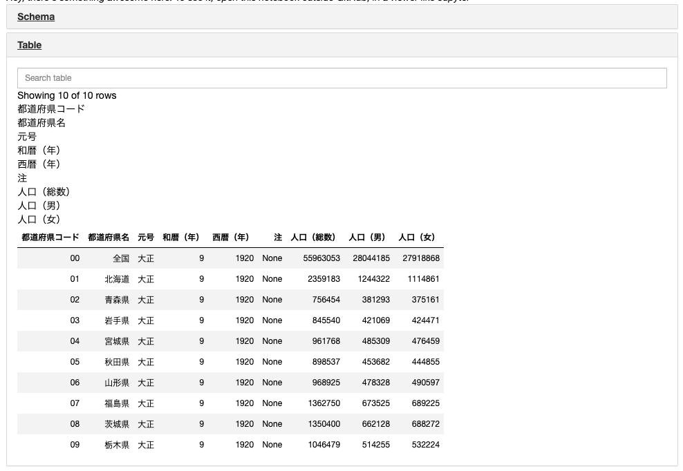

# purpose of this image

This image is for studying pyspark. You can use pyspark, read S3 files, and read Azure Storage files.

# components

- spark 2.4.5
- hadoop 3.2.1
- Anaconda3-2019.10-Linux-x86_64(python3.7.4)

# docker run
run this command

```
docker run -v `pwd`:/work -p8888:8888 -it --rm neppysan/pyspark
```

and you will see this message.

```
To access the notebook, open this file in a browser:
			file:///root/.local/share/jupyter/runtime/nbserver-6-open.html
	Or copy and paste one of these URLs:
			http://2457d17b9863:8888/?token=7a466b3b8d558c34ea7b62ef3b6da95ed83a403d0a210847
	 or http://127.0.0.1:8888/?token=7a466b3b8d558c34ea7b62ef3b6da95ed83a403d0a210847
```

copy `http://127.0.0.1:8888/?token=...` and paste it on your browser, then you can use jupyter notebook.


# sample jupyter notebook

look at sample.jpynb

## use pixiedust

``` python3
import pixiedust
```

When you import pixiedust, you are asked to restart Kernel.  Click Kernel > Restart.



## Access S3

Read files on S3 like this.

```python3
spark.sparkContext._jsc.hadoopConfiguration().set("fs.s3a.access.key", S3_ACCESS_KEY)
spark.sparkContext._jsc.hadoopConfiguration().set("fs.s3a.secret.key", S3_SECRET_KEY)

df = spark.read.csv("s3a://{}/testdir".format(S3_BUCKET_NAME), encoding='shift-jis', header=True)
```
Then, visualize this file.

```python3
display(df)
```

pixiedust is very useful. You can create a good-looking graph without coding. In order to use pixiedust, `import pixiedust` and `display(df)`. df is a spark dataframe or pandas dataframe.



## Access Azure Storage

Read files on Azure Storage (Data Lake gen2)

```python3
spark.conf.set(
  "fs.azure.account.key.{}.dfs.core.windows.net".format(AZURE_STORAGE),AZURE_SECRET)
  
  df3 = spark.read.csv("abfss://testcontainer@{}.dfs.core.windows.net/".format(AZURE_STORAGE), encoding='shift-jis', header=True)
```


# reference

for more infomation...

## pixiedust

https://github.com/pixiedust/pixiedust

## Spark S3 Access 

https://hadoop.apache.org/docs/current/hadoop-aws/tools/hadoop-aws/index.html

## Spark Azure Storage Access

https://hadoop.apache.org/docs/current/hadoop-azure/abfs.html

https://deep.data.blog/2019/07/12/diy-apache-spark-and-adls-gen-2-support/

https://spark.apache.org/docs/latest/hadoop-provided.html

